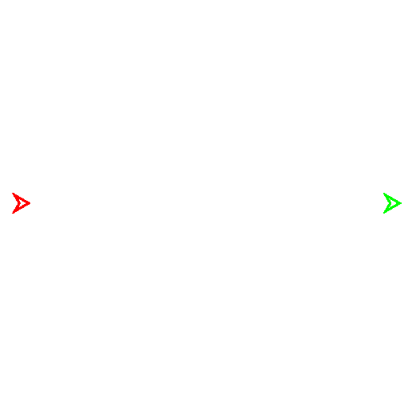

# Genetic Programming for the Game of Two Cars
This example demonstrates the [modular-coevolution](https://github.com/SeanNHarris/modular-coevolution) library on a simple pursuit-evasion game.

## Game Description



 In the Game of Two Cars, a pursuer (red) tries to capture an evader (green) by moving within its capture radius (white circle).
 The pursuer and evader both have constant velocity and a maximum turning radius.
 To make the game interesting, the pursuer is faster than the evader, but the evader can turn more quickly, giving it the opportunity to dodge the pursuer.
 This requires the pursuer to anticipate the trajectory of the evader, and encourages the evader to mislead the pursuer.

## Anatomy of the Code

The provided code is made up of the following parts:
- Game implementation - [twocarsgame.py](twocarsgame.py) and [stateactiongame.py](stateactiongame.py)
  - The game serves as an "evaluation function" to determine the fitness of a strategy.
    The implementation of an evaluation function is fairly open-ended compared to the rest of the process of creating an experiment.
- [Experiment definition](#Experiment-Definition) - [twocarsexperiment.py](twocarsexperiment.py)
  - The experiment class extends `modularcoevolution.experiments.baseexperiment.BaseExperiment` and tells the `modular-coevolution` library how to set up and run this experiment.
    It defines the experiment parameters, the modules used for evolution, and the evaluation function.
- [Agent class](#Agent-Class) - [agents/twocarsgpagent.py](agents/twocarsgpagent.py)
  - The agent class extends `modularcoevolution.agents.baseagent.BaseAgent` and defines the agent's behavior and what kind of genotype it has.
    In this case, we use a pre-made template for agents that use genetic programming trees (`modularcoevolution.agents.basegpagent.BaseGPAgent`).
- [Genetic programming tree nodes](#Genetic-Programming) - [gpnodes/twocarsgpnode.py](gpnodes/twocarsgpnode.py)
  - This class extends `modularcoevolution.genotypes.geneticprogramming.gpnode.GPNode` and defines the set of nodes that serve as building blocks for a genetic programming tree.
    Through evolution, these nodes will be combined to create strategies for the agents.

## Getting Started

We'll go through the code step-by-step as if you were writing it from scratch, to explain all the pieces.
Feel free to follow along yourself or modify the existing code to explore how it works.
We'll skip the game implementation, however, as it's mostly independent from the details of the library.

### Terminology and Library Design

As a brief introduction to the `modular-coevolution` library, here is a quick run-through of the primary components and how they interact:

- **Driver** - Initializes and runs the experiment.
  - Initializes and references an **Experiment** object.
  - Controls a **Manager** object, which runs the evolutionary process.
  - Performs evaluations via the **Experiment** on behalf of the **Manager**.
  - Runs the main loop of the experiment.
  - See the [CoevolutionDriver](https://github.com/SeanNHarris/modular-coevolution/blob/master/modularcoevolution/drivers/coevolutiondriver.py) class for details.
- **Experiment** - Defines the experiment and its parameters.
  - Provides the evaluation function to the **Driver**, which evaluates the performance of one or more **Agents**.
  - Initializes the **Generator** objects for each population.
  - Initializes the **Manager** object with the **Generators**.
  - See the [BaseExperiment](https://github.com/SeanNHarris/modular-coevolution/blob/master/modularcoevolution/experiments/baseexperiment.py) class for details.
- **Manager** - Manages evolution and coevolution.
  - Manages its **Generators** by providing their **Agents** to the **Driver** and relaying back their evaluation results. Tells them when to start the next generation of evolution.
  - Responsible for opponent sampling, i.e., deciding which **Agents** will participate in each evaluation.
  - See the [Coevolution](https://github.com/SeanNHarris/modular-coevolution/blob/master/modularcoevolution/managers/coevolution.py) class for details.
- **Generator** - Manages a single population of individuals.
  - Typically maintains and evolves a population of **Genotypes** based on their evaluation results.
  - Creates **Agents** from its **Genotypes** when requested by the **Manager**.
  - Applies evaluation results received from the **Manager** to its **Genotypes**.
  - See, for example, the [BaseEvolutionaryGenerator](https://github.com/SeanNHarris/modular-coevolution/edit/master/modularcoevolution/generators/baseevolutionarygenerator.py)
    and [EvolutionGenerator](https://github.com/SeanNHarris/modular-coevolution/blob/master/modularcoevolution/generators/evolutiongenerator.py) classes for details.
- **Genotype** - Represents an individual strategy or solution in a population.
  - Contains the genetic information that defines a solution, which can mutate or be recombined with other **Genotypes**.
  - Does not participate in evaluations directly, is instead used to create an **Agent** for that purpose by its **Generator**.
  - Maintains a set of metrics that are updated when it receives evaluation results from its **Manager**.
  - In genetic programming, the **Genotype** is a tree of functions which can be executed.
  - See, for example, the [BaseGenotype](https://github.com/SeanNHarris/modular-coevolution/blob/master/modularcoevolution/genotypes/basegenotype.py)
    and [GPTree](https://github.com/SeanNHarris/modular-coevolution/blob/master/modularcoevolution/genotypes/geneticprogramming/gptree.py) classes for details.
- **Agent** - Represents a player or solution in an evaluation.
  - Typically built around a **Genotype**, which parameterizes its behavior (though hand-coded agents can be useful to provide a reference opponent).
  - Contains logic for how to play a specific game or otherwise participate in an evaluation.
  - Created by a **Generator** for a single evaluation and then discarded.
  - See, for example, the [BaseEvolutionaryAgent](https://github.com/SeanNHarris/modular-coevolution/blob/master/modularcoevolution/agents/baseevolutionaryagent.py)
    and [BaseGPTreeAgent](https://github.com/SeanNHarris/modular-coevolution/blob/master/modularcoevolution/agents/basegptreeagent.py) classes for details.
    
## Experiment Definition

The experiment class defines the experiment and all of its properties.
It extends [BaseExperiment](https://github.com/SeanNHarris/modular-coevolution/blob/master/modularcoevolution/experiments/baseexperiment.py), which has a number of abstract methods that need to be implemented.

### Initialization

First, we define the class and its `__init__` method.
The `__init__` method takes a config dictionary as a parameter, and typically handles setting up the experiment based on the configuration.
Make sure to call `super().__init__(config)` to make the evolutionary parameters available to the base class.

By standard, the experiment configuration parameters are stored in `config['experiment']`, though this isn't currently enforced.
We use those parameters to initialize the game state as `self.game`.

```python
from typing import Any

from modularcoevolution.experiments.baseexperiment import BaseExperiment

import geneticprogramming.twocars.twocarsgame as twocarsgame
from geneticprogramming.twocars.stateactiongame import StateActionGame


class TwoCarsExperiment(BaseExperiment):
    game: StateActionGame[twocarsgame.TwoCarsState]
    """The starting state of the game given the configured parameters.
    This uses a successor function to generate further states, and is not modified."""
    
    def __init__(self, config: dict[str, Any]):
        super().__init__(config)

        experiment_config = config['experiment']
        pursuer_speed = experiment_config['pursuer_speed']
        pursuer_turn_radius = experiment_config['pursuer_turn_radius']
        pursuer_turning_rate = pursuer_speed / pursuer_turn_radius
        pursuer_x = experiment_config['pursuer_x']
        pursuer_y = experiment_config['pursuer_y']
        pursuer_heading = experiment_config['pursuer_heading']

        evader_speed = experiment_config['evader_speed']
        evader_turn_radius = experiment_config['evader_turn_radius']
        evader_turning_rate = evader_speed / evader_turn_radius
        evader_x = experiment_config['evader_x']
        evader_y = experiment_config['evader_y']
        evader_heading = experiment_config['evader_heading']

        capture_radius = experiment_config['capture_radius']
        game_duration = experiment_config['game_duration']

        initial_pursuer_state = twocarsgame.CarState(pursuer_speed, pursuer_turning_rate, pursuer_x, pursuer_y, pursuer_heading)
        initial_evader_state = twocarsgame.CarState(evader_speed, evader_turning_rate, evader_x, evader_y, evader_heading)
        initial_state = twocarsgame.new_state(game_duration, capture_radius, initial_pursuer_state, initial_evader_state)

        self.game = StateActionGame[twocarsgame.TwoCarsState](
            initial_state,
            twocarsgame.step,
            twocarsgame.current_player,
            twocarsgame.is_terminal,
            twocarsgame.payoff
        )
```

### Players and Populations

Two key concepts in the creation of experiment classes are **players** and **populations**.
Players are simply the individual slots for agents in a given game, while populations are the pools those agents can be drawn from.
Most commonly, a population corresponds to an evolutionary algorithm generating the agents, but they can also be fixed sets of agents or other algorithms.
Multiple players can be drawn from the same population if their agents can function in either role.

We define the players and populations for the experiment by extending the following abstract methods:
- `player_populations`
  - Return a list containing the population index which each player is drawn from.
    For a two-player game, this would be either `[0, 0]` or `[0, 1]` depending on
    whether the two players are drawn from the same population.
  - Here, we plan to use a separate population for the pursuer and evader, so we return `[0, 1]` (first player from population 0, second from population 1).
- `population_names`
  - Return a list containing the name of each population.
    These names will be used in the config file and logs.
  - We return `['pursuer', 'evader']` to name the populations.
- `population_agent_types`
  - Return a list containing the agent type of each population.
  - This lets the experiment inform the population generators what type of agents to generate.
    We haven't created the agent classes yet, but we'll use a to-be-written `TwoCarsGPAgent` for both populations.
- `population_generator_types`
  - Return a list containing the generator type of each population.
  - This function assigns a [BaseGenerator](https://github.com/SeanNHarris/modular-coevolution/blob/master/modularcoevolution/generators/basegenerator.py) for each population.
    We'll use [EvolutionGenerator](https://github.com/SeanNHarris/modular-coevolution/blob/master/modularcoevolution/generators/evolutiongenerator.py) for both populations, which is a basic evolutionary algorithm.

```python
from typing import Sequence

from modularcoevolution.generators.evolutiongenerator import EvolutionGenerator

from geneticprogramming.twocars.agents.twocarsgpagent import TwoCarsGPAgent


def player_populations(self) -> Sequence[int]:
    return [0, 1]

def population_names(self) -> Sequence[str]:
    return ['pursuer', 'evader']

def population_agent_types(self) -> Sequence[type]:
    return [TwoCarsGPAgent, TwoCarsGPAgent]

def population_generator_types(self) -> Sequence[type]:
    return [EvolutionGenerator, EvolutionGenerator]
```

### Evaluation

We need to define the evaluation function, which plays our agents against each other to determine their performance.
`get_evaluate` will be called by the driver with a list of agents corresponding to `player_populations` drawn from the associated populations.
In some cases, we also include keyword arguments, typically as flags for special evaluation modes.
The most common flag is `exhibition`, which is automatically passed by the driver for special evaluations meant to be shown to the user.
This might indicate a need to collect additional data for visualization purposes.

Note that `get_evaluate` returns a function, rather than itself being an evaluation function.

In our case, we've already got a suitable evaluation function from the game implementation, so we just write the following:

```python
from functools import partial

from modularcoevolution.experiments.baseexperiment import EvaluateProtocol


def get_evaluate(self, **kwargs) -> EvaluateProtocol:
    return partial(self.game.evaluate, **kwargs)
```

Using `partial` in this case is redundant, but it's a common pattern to allow fixed arguments to be bound to the evaluation function.
Here's an example of that from a different experiment:

```python
def get_evaluate(self, **kwargs) -> EvaluateProtocol:
    return partial(evaluate, world_parameters=self.world_parameters, goals=self.goals, attackers=self.attackers, defender=self.defender, **kwargs)
```

It's also common to just define an `evaluate` function within the experiment class, if it's simple or doesn't need to be reused.

For reference, the `evaluate` function in the game implementation looks like this:

```python
def evaluate(self, agents: Sequence[BaseAgent], exhibition: bool = False, **kwargs) -> Sequence[dict[str, Any]]:
    state = self.initial_state
    state_history = []
    if exhibition:
        state_history.append(state)
    while not self.is_terminal(state):
        player = self.current_player(state)
        action = agents[player].perform_action(state)
        state = self.step(state, action)
        if exhibition:
            state_history.append(state)

    results: list[dict[str, Any]]
    results = [{'payoff': float(self.payoff(state, player))} for player in range(len(agents))]
    if exhibition:
        exhibition_data = {'states': state_history}
        results.append(exhibition_data)
    return results
```

The evaluation function returns a list of dictionaries, one for each player, containing a list of string-keyed results for that player.
In this case, the only result is the `payoff`, which is the score the agent received from the game.
Often, especially in multiobjective optimization, there will be multiple result keys.
Additionally, it is permitted to include an additional dictionary after all the player results, containing additional data which isn't used during evolution but is useful for visualization or logging.

The values of these results are not automatically treated as fitness, and often the fitness of an agent is calculated as a function based on these results.
We do this by defining **metrics** for our populations.

### Metrics

Metrics are values stored by each individual in a population, including but not limited to the fitness.
We define metrics using a [baseexperiment.PopulationMetrics](https://github.com/SeanNHarris/modular-coevolution/blob/master/modularcoevolution/experiments/baseexperiment.py) object, which helps us configure and store the definitions for these metrics.
This is done in the `_build_metrics` function:

```python
from modularcoevolution.experiments.baseexperiment import PopulationMetrics


def _build_metrics(self) -> Sequence[PopulationMetrics]:
    metrics = PopulationMetrics()
    metrics.register_fitness_function('payoff')
    return [metrics, metrics] 
```

While there are many different types of metrics, defining a fitness function is the most common use case, so `PopulationMetrics` provides a simplified function for that.
`register_fitness_function` accepts either a string key referencing a result from the evaluation function to use directly as fitness,
or a function that takes the results dictionary and computes a fitness value.
The latter is useful if you need to negate or process a result, or if you need to combine multiple values to get the fitness.

Here, we're just using the value of `payoff` as the fitness directly, so we just pass in the string key.

We need to return a list of `PopulationMetrics` objects, one for each population.
Since both populations are using the same metrics, we can safely return a list with the same object twice.

Aside from defining a fitness function, you can also define other metrics that you want to track.
View the documentation for `PopulationMetrics.register_metric` for more information.
This is also necessary in the case of multiobjective optimization, where you might have multiple "fitness functions".

### Visualization

While not required, we want to include a function to visualize the games played by our agents.
In general, the driver will automatically run "exhibition games" between the best agents and save the results in text.
To add visualizations to this, we need to extend the `_process_exhibition_results` function from the base class.
This function is called after every exhibition game with the results of the game.

Here, since the evaluation function returns a full log of the game state during exhbition games,
we can use the provided `twocarsgame.render_evaluation_gif` function to save an animation of the game states.
The `agent_numbers` parameter is used here to name the file based on the agents that played in the game.

```python
def _process_exhibition_results(self, agent_group, agent_numbers, agent_names, result, log_path):
    super()._process_exhibition_results(agent_group, agent_numbers, agent_names, result, log_path)
    number_string = '-'.join([str(number) for number in agent_numbers])
    twocarsgame.render_evaluation_gif(result[-1]['states'], log_path + "/" + f'exhibitionRender{number_string}')
```

You can find a completed example of the experiment class in [twocarsexperiment.py](twocarsexperiment.py).

## Agent Class

Before we can run the experiment, we need to define the agent class.
Agents are the objects sent to the evaluation function to play the game, and are subclasses of [BaseAgent](https://github.com/SeanNHarris/modular-coevolution/blob/master/modularcoevolution/agents/baseagent.py).

In general, the base agent class is a little complicated to work with in the current version of the library,
but for basic genetic programming-based agents an easy template is provided by extending [BaseGPTreeAgent](https://github.com/SeanNHarris/modular-coevolution/blob/master/modularcoevolution/agents/basegptreeagent.py).

### Initialization

Since most of the work is already done for us, initializating the class just looks like this:

```python
from modularcoevolution.agents.basegptreeagent import BaseGPTreeAgent


class TwoCarsGPAgent(BaseGPTreeAgent):
    def __init__(self, parameters=None, genotype=None, **kwargs):
        super().__init__(parameters=parameters, genotype=genotype, **kwargs)
```

Make sure to pass the `parameters` and `genotype` arguments to the superclass constructor here or it won't function properly.

### Genotype Parameters

In order to specify the properties of the genetic programming trees used by the agent, we need to implement the `genotype_parameters` method:

```python
from typing import Any

from geneticprogramming.twocars.gpnodes.twocarsgpnode import TwoCarsGPNode, FLOAT

@classmethod
def genotype_default_parameters(cls, agent_parameters: dict[str, Any] = None) -> dict[str, Any]:
    return {'node_type': TwoCarsGPNode, 'return_type': FLOAT}
```

`node_type` specifies the class that defines the nodes to construct the tree from, which we'll define in the next section.
`return_type` specifies a type that the tree will return when evaluated, which is used to determine the type of the root node.
Be aware that this "return type" is not a python type, but part of the type system used by the genetic programming tree, which we'll discuss shortly.
For now, just assume that we've decided that our agent strategy will return a floating point value based on its inputs.

Another common parameter not used here is `fixed_context`, which is a dictionary of values that the tree can access during creation and evaluation.
These values must be independent of the current state of the game, and usually give the range of possible values for constants that the tree generates.
This can technically also be specified in the configuration file, but doing it here allows the values to be determined at runtime based on other parameters.

### Agent Behavior

The agent's behavior is defined in the `perform_action` method, which is called by the evaluation function to get the agent's move.
The exact parameters and return type of this function aren't specified by the base class, so it's permitted to customize this for the needs of a specific type of game.

For the Game of Two Cars, our action is simply how much our agent wants to turn during this timestep, in the range `[-1.0, 1.0]`.
Our example implementation is shown below:

```python
from warnings import warn

from geneticprogramming.twocars.twocarsgame import TwoCarsState


def perform_action(self, state: TwoCarsState) -> float:
    context = {'state': state}
    try:
        action = self.genotype.execute(context)
    except ArithmeticError as error:
        warn(f"Arithmetic error executing genotype:\n{error}")
        action = 0.0
    clamped_action = min(max(-1.0, action), 1.0)
    return clamped_action
```

The agent's genetic programming tree is an instance of the [GPTree](https://github.com/SeanNHarris/modular-coevolution/blob/master/modularcoevolution/genotypes/geneticprogramming/gptree.py) class
stored in the `self.genotype` attribute, and can be queried with the `GPTree.execute` method.
`execute` takes a context dictionary as an argument, which contains a user-defined set of values that the tree is designed to access.
In this simple implementation, we query the agent strategy tree with the current game state, and return its output as the agent's turning action (clamped to the allowed range).
We also catch arithmetic errors caused by the tree and re-raise them as warnings, since an arbitrary tree might cause overflow errors and the like.

And that's all we need to define the agent class, thanks to the provided template.
Without the BaseGPTreeAgent superclass, the code isn't especially longer, but it's a lot more unintuitive to get right due to some details of the base agent design which may change in the future.

You can find a completed example of the agent class in [agents/twocarsgpagent.py](agents/twocarsgpagent.py).

## Genetic Programming

In genetic programming, evolved solutions to a problem are represented as trees of functions which are evaluated to return an output value from the root.
Managing and evolving these trees is handled for you by the [GPTree](https://github.com/SeanNHarris/modular-coevolution/blob/master/modularcoevolution/genotypes/geneticprogramming/gptree.py) class, so all you need to do is define the nodes that make up the tree.
This is done by extending the [GPNode](https://github.com/SeanNHarris/modular-coevolution/blob/master/modularcoevolution/genotypes/geneticprogramming/gpnode.py) class.

### Data Types

The `GPTree` implementation in this library is based on a variant of genetic programming called Strongly-Typed Genetic Programming,
which allows multiple data types to be used within the tree.
This gives the user more flexibility in designing the nodes for the tree, and is automatically enforced during evolution.

The data types we define for the tree do not need to correspond to python types;
they are just labels indicating how different nodes are allowed to connect together.

For our example, we will use two data types: `FLOAT` and `BOOL`.
Since these are just labels, they are typically defined at the start of the file as string constants.

When creating the `GPNode` subclass, we then need to implement its `data_types` class method to tell it which data types it has available.

```python
from typing import Sequence

from modularcoevolution.genotypes.geneticprogramming.gpnode import GPNode, NodeType


FLOAT = 'float'
BOOL = 'bool'


class TwoCarsGPNode(GPNode):
    @classmethod
    def data_types(cls) -> Sequence[NodeType]:
        return [FLOAT, BOOL]
```

This is actually the complete implementation of the `TwoCarsGPNode` class, as all of its primitive functions are declared externally.

### Primitive Functions

Each function that will be available to the tree is defined using a decorator, primarily `[YourGPNode].gp_primitive`.
This decorator takes two inputs: the data type returned by the function, and the data types of its arguments as a tuple.
Functions with this decorator are automatically added to the list of available functions for the tree.

**Note**: Make sure to call the `gp_primitive` function belonging to your own class, not `GPNode.gp_primitive`.
The decorator is a class method, and will apply to the class it's called on.

Below is an example of the form which the function needs to take:

```python
@TwoCarsGPNode.gp_primitive(FLOAT, (FLOAT, FLOAT))
def add(input_nodes, context):
    left = input_nodes[0].execute(context)
    right = input_nodes[1].execute(context)
    return left + right
```

This function is an addition operator, so we tell its decorator that it outputs a `FLOAT` and takes two `FLOAT` inputs.

The `input_nodes` parameter is a list of the child nodes of the current node.
The base `GPNode` class has an `execute` method that runs that child node's primitive function and returns its result.
So for this example, we just execute the two input nodes and return their sum.

The `context` parameter is a dictionary that can be used to store any additional information the tree needs to access, such as the game state.
Typically, the context is used in "sensor" terminal nodes, which have no children and return a value based on the agent's observations.
The context dictionary is initially passed in with `GPTree.execute(context)`.
In our case, this will be the same context dictionary that we defined in the agent's `perform_action` method.

Note that in advanced use cases, the `context` dictionary can be modified by the nodes to allow for complex behavior,
such as storing memory values or looping over a list of values, where one terminal node is based on the loop iteration.

Below are two more examples of primitive functions that we might use in our implementation:

```python
@TwoCarsGPNode.gp_primitive(FLOAT, (BOOL, FLOAT, FLOAT))
def if_else(input_nodes, context):
    condition = input_nodes[0].execute(context)
    if condition:
        return input_nodes[1].execute(context)
    else:
        return input_nodes[2].execute(context)
```

This function takes three inputs of different types: a `BOOL` for the condition, and two `FLOAT` values for the true and false branches.
Note that we've defined this function in such a way that only the chosen branch will be executed,
which is relevant if any nodes have side effects beyond their return value.


```python
from geneticprogramming.twocars.twocarsgame import TwoCarsState


@TwoCarsGPNode.gp_primitive(FLOAT, ())
def time_ratio_remaining(input_nodes, context):
    """Number of timesteps remaining in the game scaled to [0, 1]."""
    state: TwoCarsState = context['state']
    return state.turns_remaining / state.total_turns
```

This is a terminal node that returns the time remaining in the game, based on the current state from the context dictionary.
Note that we use a docstring here to give a description of the function.
The `GPNode` class has some experimental functionality to automatically generate documentation for the primitive functions using these,
and they will probably be visible to various tools in the future.

### Literal Nodes

In addition to primitive functions, we can also define literal nodes that return a randomly-selected constant value.
The value of the node is defined when that node is originally created, and is then preserved as a constant through evolution.

Literal nodes are defined using the `[YourGPNode].gp_literal` decorator, with the data type of the node as its argument.
Literal nodes are always terminal nodes, and have no inputs.
Again, make sure to call the `gp_literal` function belonging to your own class.

Unlike primitive nodes, the return value for this function is used to initialize the node's constant value, and isn't called during execution of the tree.
Typically, your function should return an appropriate random value. Examples for `FLOAT` and `BOOL` are shown below:

```python
import random


@TwoCarsGPNode.gp_literal(FLOAT)
def float_literal(fixed_context):
    return random.uniform(-10, 10)


@TwoCarsGPNode.gp_literal(BOOL)
def bool_literal(fixed_context):
    return random.random() < 0.5
```

The `fixed_context` parameter is given as a parameter to the `GPTree` when it's created, as discussed above regarding the agent class' `genotype_default_parameters` method.
This dictionary is usually used to pass in the range of possible values for the literals as a parameter,
or specify the size of a list-based literal to be based on parameters of the game.

Here is an example of this from a different game, which allows the tree to reference a specific player ID as a literal value.

```python
@ObservationGPNode.gp_literal(PLAYER)
def player_literal(fixed_context):
    return random.randrange(fixed_context['player_count'])
```

A full example implementation of the `TwoCarsGPNode` class is provided in [gpnodes/twocarsgpnode.py](gpnodes/twocarsgpnode.py).
Feel free to use this as a starting point, or design your own from scratch.
The example implementation is a bit artificially complex for demonstration purposes;
in practice, it probably isn't necessary to use the `BOOL` data type or the `if_else` function for this problem.
However, there are some additional features which might improve this set of nodes, 
such as adding new sensors, adding trigonometric functions so it can work better with angles,
or giving the agents some type of memory of past states.

### Design Tips

- Think about how you might design a strategy to play this game, and identify what building blocks you'd need to make that in a tree.
  - When imagining how your nodes might be used, keep in mind how likely it is for a specific subtree to be discovered by chance.
    If a node is only useful as part of a large, complicated subtree, the EA may never figure out how to use it.
  - Consider doing part of the work for the EA by creating nodes which encapsulate a complicated but useful element.


- Start with a small set of nodes and add more as needed.
  - Having too many nodes can overwhelm the evolutionary algorithm with too large of a search space,
    but having too few can limit the complexity of possible strategies.


- Data types let you limit which nodes can interact, even if the python data types are compatible.
  - For some function parameters, generating that parameter with a large, complex subtree is overkill.
    You can define a special data type for that parameter which is only matched by terminal nodes to limit the scope of search.

### Genetic Programming Appendix: Other Features

For completeness, this section lists a few other features of the genetic programming tools that may be useful in more advanced cases.

#### GPNode Inheritance

In scenarios where two populations require sets of nodes which only partially overlap,
be aware that you can write a base class containing the shared node functions, and then write a subclass to add the additional nodes for each agent type.
The `GPNode` class has specialized code to ensure that the correct node data is inherited by subclasses.

An alternative approach involves providing an additional `forbidden_nodes` parameter to the `GPTree` class in the `genotype_default_parameters` method of each agent.
This parameter should be a sequence of node IDs which trees for that agent are not allowed to use.
This is mainly useful when there are only a few specific nodes that should be excluded, as it needs to be manually maintained.

#### Additional Decorators

In addition to `gp_primitive` and `gp_literal`, there are a number of other decorators that can be used to define special functions used by the `GPTree`.

- `gp_literal_serializer` - Designates a function to serialize literal values of a certain type to a string.
  - This is necessary when one of the literal types in your tree is not hashable or JSON-seralizable (like a Numpy array).
  - Requires a `gp_literal_deserializer` function to be defined as well for that type.
- `gp_literal_deserializer` - Designates a function to deserialize a string back into a literal value of a certain type.
  - This should be the inverse of a corresponding `gp_literal_serializer` function.
- `gp_literal_mutator` - Designates a special function to mutate a type of literal node.
  - Normally, the only way to perform mutation on a literal node is to replace it with a new random literal, using its literal function.
  - This decorator allows you to define a custom mutation function for that type of literal node.
- `gp_type_renderer` - Used as part of the [TreePlot](https://github.com/SeanNHarris/modular-coevolution/blob/master/modularcoevolution/graphics/treeplot.py) tool
  for rendering `GPTree` individuals in Matplotlib.
  - By default, this tool will display the value of each node as a string, but this decorator lets you define a custom plotting function for nodes with a given output type.

## Configuration Files

The parameters for your experiment are stored in a configuration file in the [TOML format](https://toml.io/en/).
The TOML format represents a nested dictionary in a format that's convenient to read and write.
The parameters beneath a header like `[experiment]` will be stored under the key `config['experiment']`.
Dots in the header represent nesting in the dictionary, so the parameters beneath `[populations.pursuer.genotype]`
will be stored under `config['populations']['pursuer']['genotype']`.

These parameters are read by your experiment class, by the evolution modules, by your agents, and by your genotypes.

Configuration files typically have the following elements, with a few important parameters highlighted:
- `log_folder` - The path within the logs directory where results for this experiment will be saved.
  **Warning**: make sure to change this if you copy-paste the configuration file, or you'll overwrite your results.
- `experiment_type` - The import path to the experiment class, which the driver will use to initialize the experiment.
- `experiment` - Parameters specific to the experiment class. These were all defined in the [`__init__` method of the experiment class](#initialization).
- `manager` - Parameters for the evolution/coevolution manager, which is the main component of the evolutionary algorithm.
  - `num_generations` - The number of generations to run the (co)evolutionary algorithm for.
  - `evaluations_per_individual` - In coevolution, the number of different opponents each individual will play against.
    Higher values improve evolution with diminishing returns, by ensuring that individuals are tested against a variety of opponents.
- `populations` - Each population's parameters are stored under a header with that population's name, as defined in the experiment's `population_names` function.
  - `populations.[name].generator` - Parameters for the generator used to create agents in that population.
    - `initial_size` - Traditionally called `μ`. The number of individuals to maintain in the population between generations.
    - `children_size` - Traditionally called `λ`. The number of children to generate each generation,
      before survival selection culls the population back to `initial_size`.
    - `mutation_fraction` - The fraction of children to generate by mutation, vs. recombination.
    - `tournament_size` - The number of competitors when reproducing by tournament selection.
      Higher values can speed up evolution by increasing selection pressure, but can lead to premature convergence by limiting exploration.
    - `top_sampling_size` - If nonzero, ensure that the top `top_sampling_size` individuals from the previous generation will used as opponents for every individual for opposing populations.
      This helps ensure that every individual encounters the dominant opponent strategies.
      **Note**: This is a nonstandard parameter, but it seems to work well here.
  - `populations.[name].agent` - Parameters for the agent class used by that population.
    These will be passed to the agent's `__init__` method as `parameters`.
  - `populations.[name].genotype` - Parameters for the genotype of the agents in that population.
    These will be combined with the `genotype_default_parameters` to initialize the genotype.
    - `parsimony_weight` - The parsimony coefficient, which penalizes larger trees in the fitness function.
      Higher values will encourage smaller trees, though on this problem that seems to harm the evader.
- `default` - Parameters that are used by all populations unless overridden by a specific population.
  Equivalent to specifying the same parameters under each population.
  - `default.generator` - Default generator parameters.
  - `default.agent` - Default agent parameters.
  - `default.genotype` - Default genotype parameters.

The default configuration file for the Two Cars experiment is provided in [config/geneticprogramming/twocars/default.toml](../../config/geneticprogramming/twocars/default.toml).
Typically, under this configuration, the two agents end up about evenly matched once the pursuer evolves enough to anticipate the evader's movement.
Feel free to try out other settings for the game configuration or the evolutionary parameters to see what happens.

## Running the Experiment

With the experiment class, agent class, and GP nodes implemented, and a configuration file set up,
you can now run the experiment, either by using one of the [provided scripts](../../scripts/geneticprogramming/twocars),
or by running `modularcoevolution.drivers.coevolutiondriver` from your IDE or directly from the command line.

You can run the experiment from the command line with the following minimal command:

```shell
python -m modularcoevolution.drivers.coevolutiondriver geneticprogramming/twocars/default.toml
```

Where the provided argument is the path to the configuration file for the experiment.
A description of the additional command line arguments available is reproduced in [this readme](../../scripts/readme.md).

In particular, note the `-np` flag, which disables parallel execution for ease of debugging,
and the `--exhibition-rate` parameter, which sets how often exhibition games are run to visualize the agents' behavior.
For technical reasons, rendering the exhibition game gifs is slow, so you should probably set this to at least `--exhibition-rate 10` to speed up execution (The default run scripts have this set to 50).

### Experiment Output

When you run the experiment, the console should display the current generation and the genetic programming trees for the top individuals in each population,
along with the top fitness values in that population.
You should also get a progress bar showing how far along evaluation is for that generation
(typically evaluation is by far the slowest part of evolution, but for this simple game you may see it waiting on other parts of the algorithm with the bar at 100%,
especially if you didn't set the `--exhibition_rate` parameter).

Your experiment results will be saved in the `logs` directory, under the path specified in the configuration file.
These results will include exhibition files (by default, showing games between the top two agents of each population, indicated by number),
a `parameters.json` file based on the current configuration, and a `data` directory containing the raw data from the experiment.

The data logger will save one log file (as a Gzip-compressed compressed JSON file) for each generation of the experiment.
See the [DataCollector](https://github.com/SeanNHarris/modular-coevolution/blob/master/modularcoevolution/utilities/datacollector.py) class for details on the logging,
or the functions in [postprocessingutils.py](https://github.com/SeanNHarris/modular-coevolution/blob/master/modularcoevolution/postprocessing/postprocessingutils.py)
if you want to read and process the logs from your experiment.

## Wrapping Up

This tutorial should have left you with a good introduction to the [modular-coevolution](https://github.com/SeanNHarris/modular-coevolution) library and the use of its genetic programming tools in particular.
Hopefully, this knowledge will make it easier to understand the library and its documentation as a whole.

If you have any questions, please contact Sean Harris, who maintains the library and this tutorial.
